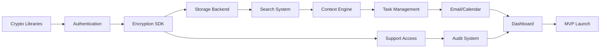

# Aura Phase 1: Sprint Timeline & Deliverables

## Visual Sprint Overview

### Month 1: Privacy Foundation 🔐

```
Week 1-2: Cryptographic Foundation
├── Day 1-3: Environment Setup & Tooling
├── Day 4-7: Crypto Libraries Integration  
├── Day 8-10: SRP-6a Authentication Build
└── Day 11-14: Authentication Testing & Demo Prep

Week 3-4: Encryption Framework
├── Day 15-17: Client Encryption SDK
├── Day 18-21: Encrypted Storage Backend
├── Day 22-24: Key Management System
└── Day 25-28: Month 1 Demo Day Preparation
```

**Month 1 Demo Day Deliverables:**
- ✅ Zero-Knowledge Login Demo
- ✅ End-to-End Encryption Demo
- ✅ Security Architecture Presentation
- ✅ 10-minute Live Demonstration

---

### Month 2: Core Services 🛡️

```
Week 5-6: Searchable Encryption
├── Day 29-31: Searchable Encryption Algorithm
├── Day 32-35: Encrypted Context Engine
├── Day 36-38: Search Performance Optimization
└── Day 39-42: Search UI & Demo Build

Week 7-8: Support Access Control  
├── Day 43-45: Access Control Framework
├── Day 46-49: Cryptographic Delegation
├── Day 50-52: Audit Trail System
└── Day 53-56: Month 2 Demo Day Preparation
```

**Month 2 Demo Day Deliverables:**
- ✅ Private Search Demo
- ✅ Support Without Access Demo
- ✅ Audit Trail Demonstration
- ✅ 15-minute Stakeholder Presentation

---

### Month 3: Intelligent Features 🤖

```
Week 9-10: Task Management
├── Day 57-59: Task Storage Architecture
├── Day 60-63: Workflow Engine
├── Day 64-66: Task UI Components
└── Day 67-70: Task Integration Testing

Week 11-12: Email & Calendar
├── Day 71-73: Email OAuth & Encryption
├── Day 74-77: Calendar Integration
├── Day 78-80: Unified Inbox UI
└── Day 81-84: Month 3 Demo Day Preparation
```

**Month 3 Demo Day Deliverables:**
- ✅ Encrypted Task Management Demo
- ✅ Email Triage & Summary Demo
- ✅ Calendar Integration Demo
- ✅ 20-minute Beta User Preview

---

### Month 4: MVP Polish 🚀

```
Week 13-14: Web Dashboard
├── Day 85-87: Dashboard Architecture
├── Day 88-91: Core UI Components
├── Day 92-94: Onboarding Flow
└── Day 95-98: Integration Testing

Week 15-16: Launch Preparation
├── Day 99-101: Security Audit
├── Day 102-105: Performance Optimization
├── Day 106-108: Documentation
└── Day 109-112: MVP Launch Event
```

**Month 4 Launch Deliverables:**
- ✅ Complete MVP Application
- ✅ Security Audit Report
- ✅ Performance Benchmarks
- ✅ 30-minute Public Demo

---

## Sprint Velocity Metrics

### Expected Deliverables Per Sprint

| Sprint | Story Points | Key Deliverables | Demo Features |
|--------|--------------|------------------|---------------|
| Week 1-2 | 40 | Auth System, Crypto Libs | Zero-Knowledge Login |
| Week 3-4 | 45 | Encryption SDK, Storage | E2E Encryption Demo |
| Week 5-6 | 50 | Search, Context Engine | Private Search |
| Week 7-8 | 55 | Support Access, Audit | Support Demo |
| Week 9-10 | 50 | Task System, Workflows | Task Management |
| Week 11-12 | 60 | Email, Calendar, Inbox | Communications |
| Week 13-14 | 55 | Dashboard, UI, Onboarding | Full Dashboard |
| Week 15-16 | 40 | Security, Performance, Launch | MVP Demo |

---

## Critical Path Dependencies



---

## Demo Day Schedule

### Month 1: Technical Demo (Week 4)
**Time:** Friday, 2:00 PM
**Duration:** 45 minutes
**Audience:** Technical team, Security advisors

**Agenda:**
1. Introduction (5 min)
2. Zero-Knowledge Auth Demo (10 min)
3. Encryption Framework Demo (10 min)
4. Architecture Deep Dive (15 min)
5. Q&A (5 min)

### Month 2: Stakeholder Demo (Week 8)
**Time:** Friday, 2:00 PM
**Duration:** 60 minutes
**Audience:** Leadership, Investors, Product team

**Agenda:**
1. Privacy Vision (5 min)
2. Search Demo (10 min)
3. Support Access Demo (15 min)
4. Market Positioning (10 min)
5. Technical Q&A (10 min)
6. Business Q&A (10 min)

### Month 3: Beta Preview (Week 12)
**Time:** Friday, 2:00 PM
**Duration:** 90 minutes
**Audience:** Beta testers, Early adopters

**Agenda:**
1. Product Introduction (10 min)
2. Task Management Demo (15 min)
3. Email/Calendar Demo (20 min)
4. Daily Workflow Walkthrough (20 min)
5. Beta Program Details (10 min)
6. Feedback Session (15 min)

### Month 4: Public Launch (Week 16)
**Time:** Tuesday, 10:00 AM
**Duration:** 2 hours
**Audience:** Press, Public, All stakeholders

**Agenda:**
1. CEO Keynote (15 min)
2. Live MVP Demo (30 min)
3. Security Presentation (15 min)
4. Customer Testimonials (20 min)
5. Pricing & Availability (10 min)
6. Press Q&A (30 min)

---

## Resource Allocation

### Team Structure per Sprint

**Weeks 1-4: Foundation Team**
- 2 Security Engineers
- 2 Backend Engineers
- 1 DevOps Engineer
- 1 QA Engineer

**Weeks 5-8: Core Services Team**
- 2 Backend Engineers
- 1 Security Engineer
- 1 Frontend Engineer
- 1 UX Designer
- 1 QA Engineer

**Weeks 9-12: Feature Team**
- 2 Backend Engineers
- 2 Frontend Engineers
- 1 Integration Engineer
- 1 UX Designer
- 2 QA Engineers

**Weeks 13-16: Launch Team**
- 2 Frontend Engineers
- 1 Backend Engineer
- 1 DevOps Engineer
- 1 Security Auditor
- 2 QA Engineers
- 1 Technical Writer

---

## Risk Mitigation Timeline

### Week 2: Crypto Library Validation
- External security review
- Performance benchmarking
- Fallback implementation ready

### Week 4: Authentication Security Audit
- Penetration testing
- Protocol verification
- Bug bounty preparation

### Week 8: Support Access Review
- Legal compliance check
- User experience testing
- Access control audit

### Week 12: Integration Security
- Third-party API review
- Data flow analysis
- Privacy impact assessment

### Week 16: Full Security Audit
- Complete penetration test
- Cryptographic review
- Compliance certification

---

## Success Criteria Checkpoints

### End of Month 1 ✓
- [ ] Zero password transmission verified
- [ ] All data encrypted client-side
- [ ] Key management operational
- [ ] 0 security vulnerabilities

### End of Month 2 ✓
- [ ] Search without decryption working
- [ ] Support access < 1 min grant time
- [ ] 100% audit trail coverage
- [ ] Performance < 200ms operations

### End of Month 3 ✓
- [ ] 5+ task types supported
- [ ] Email sync < 30 seconds
- [ ] Calendar conflicts detected
- [ ] 90% feature completion

### End of Month 4 ✓
- [ ] 99.9% uptime achieved
- [ ] Security audit passed
- [ ] 500+ beta signups
- [ ] Launch event success

---

## Continuous Improvement Process

**Daily Standups:** 9:00 AM
- Progress updates
- Blocker identification
- Demo preparation

**Weekly Reviews:** Fridays 3:00 PM
- Sprint retrospective
- Demo dry runs
- Security updates

**Bi-weekly Planning:** Every other Monday
- Sprint planning
- Resource allocation
- Risk assessment

**Monthly Demos:** Last Friday
- Stakeholder presentation
- Feedback collection
- Roadmap adjustment